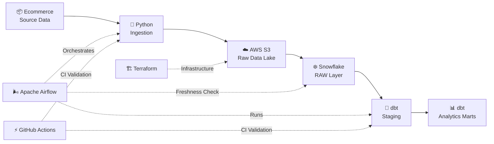
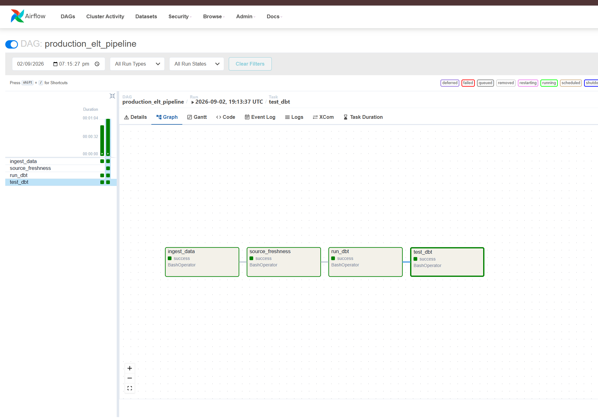
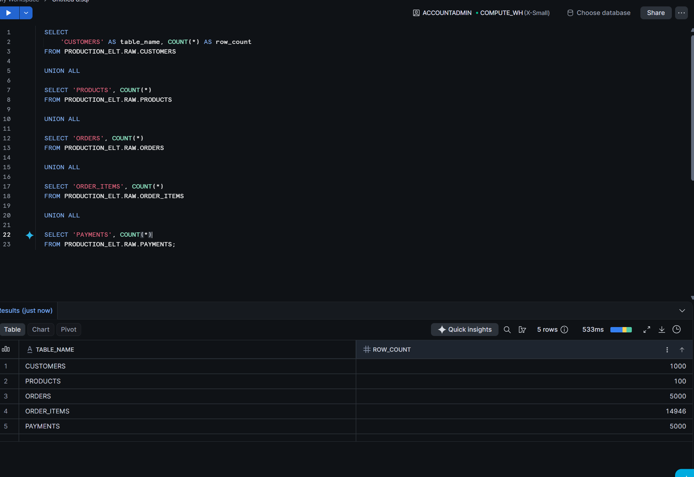
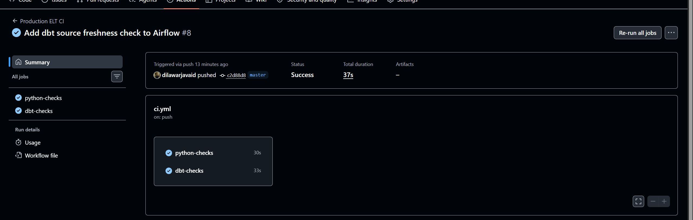

# ☁️ Cloud-Native ELT Platform | AWS • Snowflake • dbt • Airflow

<p align="center">
  <strong>End-to-end cloud data engineering with AWS S3, Snowflake, dbt, Airflow, Terraform & CI/CD.</strong>
</p>

## 📌 Overview

This project implements a production-style **ELT data platform** for ecommerce data.

The platform ingests raw transactional data using Python, stores immutable raw datasets in **Amazon S3**, loads them into **Snowflake**, transforms them into analytics-ready fact and dimension models using **dbt**, and orchestrates the complete workflow using **Apache Airflow**.

Infrastructure configuration is managed using **Terraform**, while **GitHub Actions** provides automated CI validation for Python and dbt code.

The project demonstrates practical data engineering concepts including:

- ELT architecture
- Cloud object storage
- Data warehousing
- Dimensional modeling
- Incremental transformations
- Data quality testing
- Source freshness monitoring
- Workflow orchestration
- Infrastructure as Code
- CI/CD
- Role-Based Access Control
- Containerized services
- Idempotent ingestion
- Batch metadata and lineage

---

## 🏗️ Architecture



## 📸 Platform in Action

### Apache Airflow Orchestration

The Airflow DAG orchestrates ingestion, source freshness validation, dbt transformations, and automated data quality testing.

<p align="center">
  
</p>

---

### Snowflake RAW Data

Raw ecommerce datasets are loaded into Snowflake and retained with ingestion metadata for traceability.

<p align="center">
  
</p>

---

### GitHub Actions CI

The CI pipeline automatically validates Python code and dbt project structure on pushes and pull requests.

<p align="center">
  
</p>

### Data Flow

**Source Data → Python Ingestion → Amazon S3 → Snowflake RAW → dbt Staging → Analytics Marts**

Apache Airflow orchestrates ingestion, source freshness validation, dbt transformations, and automated data quality testing.
---

# ⚙️ Technology Stack

| Layer | Technology |
|---|---|
| Programming | Python 3.11 |
| Cloud Storage | Amazon S3 |
| Data Warehouse | Snowflake |
| Transformation | dbt |
| Orchestration | Apache Airflow |
| Metadata Database | PostgreSQL |
| Execution | Airflow LocalExecutor |
| Containers | Docker / Docker Compose |
| Infrastructure as Code | Terraform |
| CI/CD | GitHub Actions |
| Version Control | Git / GitHub |

---

# 🔄 Pipeline Workflow

The Airflow DAG orchestrates the complete ELT lifecycle:

```text
ingest_data
     │
     ▼
source_freshness
     │
     ▼
run_dbt
     │
     ▼
test_dbt
```

### 1. `ingest_data`

The Python ingestion layer:

- Reads generated ecommerce datasets
- Validates incoming data
- Adds ingestion metadata
- Generates unique batch identifiers
- Prevents duplicate processing
- Stores raw batches locally
- Uploads raw datasets to Amazon S3

### 2. `source_freshness`

dbt verifies that Snowflake RAW sources contain sufficiently recent data before transformations continue.

### 3. `run_dbt`

dbt builds the analytical transformation layer.

### 4. `test_dbt`

Automated data quality tests validate the resulting models.

Airflow tasks include retry configuration to improve pipeline resilience.

---

# 🧱 Data Warehouse Architecture

The Snowflake warehouse follows a layered transformation design.

```text
RAW
 │
 ▼
STAGING
 │
 ▼
MARTS
```

## RAW Layer

Raw source tables include:

- `CUSTOMERS`
- `PRODUCTS`
- `ORDERS`
- `ORDER_ITEMS`
- `PAYMENTS`

Raw records retain ingestion metadata including:

```text
_batch_id
_ingested_at
```

This provides traceability between source batches and warehouse records.

---

# 🧹 dbt Staging Layer

Staging models standardize raw Snowflake data before downstream analytics.

Examples:

```text
stg_customers
stg_products
stg_orders
stg_order_items
stg_payments
```

Staging models are materialized primarily as **views**.

---

# 📊 Analytics Models

The marts layer contains analytics-ready dimensional models.

### Dimensions

```text
dim_customers
dim_products
```

### Facts

```text
fct_orders
fct_order_items
```

### Aggregations

```text
customer_sales_summary
```

These models support common ecommerce analytics such as:

- Customer purchasing behavior
- Order performance
- Product sales
- Revenue analysis
- Customer lifetime activity

---

# ⚡ Incremental Processing

The project includes an incremental dbt model:

```text
fct_orders_incremental
```

Instead of rebuilding the complete dataset on every execution, incremental processing allows only new or changed records to be processed.

This pattern improves performance and reduces warehouse compute usage as data volume grows.

---

# 🕒 Historical Tracking with dbt Snapshots

Customer history is tracked using a dbt snapshot:

```text
customers_snapshot
```

Snapshots preserve historical versions of changing records, enabling Slowly Changing Dimension-style analysis.

---

# 🧪 Data Quality

The project uses dbt tests to enforce data quality expectations.

Tests include:

- `not_null`
- `unique`
- `relationships`
- `accepted_values`

The pipeline currently executes **40+ automated dbt tests**.

A failed critical test causes the Airflow workflow to fail rather than silently publishing unreliable analytical data.

---

# ⏱️ Source Freshness Monitoring

dbt source freshness checks verify whether source data has been updated within expected time windows.

Airflow executes freshness validation before transformations:

```text
ingestion
    ↓
freshness check
    ↓
transformations
```

This prevents stale upstream data from silently propagating through the analytics layer.

---

# ☁️ AWS S3 Data Lake Layer

Amazon S3 acts as the raw cloud storage layer.

Raw ingestion batches are stored separately from transformed warehouse data.

The bucket configuration includes:

- Versioning
- Public access blocking
- Snowflake storage integration
- Batch-oriented raw data organization

Terraform manages the infrastructure configuration.

---

# 🏔️ Snowflake Integration

Snowflake accesses S3 using a storage integration and external stage.

```text
Amazon S3
    │
    ▼
Snowflake Storage Integration
    │
    ▼
External Stage
    │
    ▼
RAW Tables
```

This avoids embedding AWS credentials directly inside Snowflake loading logic.

---

# 🔐 Security & RBAC

The transformation pipeline follows the principle of least privilege.

Instead of running dbt using `ACCOUNTADMIN`, a dedicated Snowflake role is used:

```text
DBT_TRANSFORMER
```

The role receives:

- Warehouse usage
- Database usage
- Read access to RAW data
- Model creation permissions in the dbt development schema

This separates transformation responsibilities from account administration.

Credentials and local dbt profiles are excluded from version control.

---

# 🌍 Infrastructure as Code

AWS infrastructure is managed using **Terraform**.

Terraform currently manages configuration for the S3 raw data bucket, including:

```text
S3 Bucket
   │
   ├── Versioning
   │
   └── Public Access Protection
```

Existing infrastructure was imported into Terraform state rather than recreated.

Terraform workflow:

```bash
terraform init
terraform validate
terraform plan
terraform apply
```

Terraform state files and sensitive variable files are excluded from Git.

---

# 🐳 Containerized Airflow

Apache Airflow runs through Docker Compose.

The architecture uses:

```text
Docker Compose
    │
    ├── PostgreSQL
    │      └── Airflow Metadata
    │
    ├── Airflow Init
    │
    ├── Airflow Scheduler
    │
    └── Airflow Webserver
```

Airflow uses:

```text
PostgreSQL
+
LocalExecutor
```

rather than the development-only SQLite/SequentialExecutor configuration.

---

# 🔁 CI/CD

GitHub Actions automatically validates the project on pushes and pull requests to `master`.

Current CI jobs:

### Python Checks

```text
Checkout
   ↓
Python 3.11
   ↓
Install dependencies
   ↓
Compile Python source
```

### dbt Checks

```text
Checkout
   ↓
Install dbt
   ↓
Create CI profile
   ↓
dbt parse
```

This catches Python syntax and dbt project errors before changes are accepted.

---

# 📂 Project Structure

```text
production-elt-platform/
│
├── .github/
│   └── workflows/
│       └── ci.yml
│
├── airflow/
│   ├── dags/
│   │   └── elt_pipeline.py
│   ├── Dockerfile
│   └── docker-compose.yml
│
├── ingestion/
│   ├── ingest.py
│   └── s3_uploader.py
│
├── productioneltplatform/
│   ├── models/
│   │   ├── staging/
│   │   └── marts/
│   ├── snapshots/
│   ├── dbt_project.yml
│   └── README.md
│
├── scripts/
│   ├── generate_data.py
│   └── test_aws.py
│
├── terraform/
│   ├── main.tf
│   └── .terraform.lock.hcl
│
├── .gitignore
├── requirements.txt
└── README.md
```

---

# 🛡️ Engineering Practices Demonstrated

This project intentionally goes beyond simply moving data between systems.

It demonstrates:

### Reliability

- Airflow retries
- Idempotent ingestion
- Source freshness validation
- Automated dbt testing

### Scalability

- Cloud object storage
- Snowflake warehouse architecture
- Incremental dbt models
- Partitioned ingestion batches

### Security

- Snowflake RBAC
- Dedicated transformation role
- AWS IAM permissions
- Public S3 access protection
- Credentials excluded from Git

### Reproducibility

- Dockerized orchestration
- Terraform infrastructure
- Pinned dbt dependencies
- Git-based version control

### Automation

- Airflow orchestration
- Automated data quality checks
- GitHub Actions CI
- Infrastructure as Code

---

# 🚀 Running the Platform

## 1. Clone the repository

```bash
git clone <repository-url>
cd production-elt-platform
```

## 2. Create a Python environment

```bash
python -m venv .venv
```

Activate the environment and install dependencies:

```bash
pip install -r requirements.txt
```

## 3. Configure environment variables

Create a local `.env` file containing the required AWS configuration.

Sensitive credentials must never be committed to Git.

## 4. Configure dbt

Create:

```text
~/.dbt/profiles.yml
```

with the required Snowflake connection configuration.

## 5. Validate dbt

```bash
cd productioneltplatform
dbt debug
dbt run
dbt test
```

## 6. Start Airflow

```bash
cd airflow
docker compose up --build
```

Then open:

```text
http://localhost:8080
```

and trigger:

```text
production_elt_pipeline
```

## 7. Validate Terraform

```bash
cd terraform

terraform init
terraform validate
terraform plan
```

Review every Terraform plan before applying infrastructure changes.

---

# 📈 Key Design Decisions

### Why ELT instead of ETL?

Raw data is loaded before transformation so Snowflake retains the original source data while dbt handles transformations inside the warehouse.

### Why S3 before Snowflake?

S3 provides durable, inexpensive raw storage and separates ingestion from warehouse processing.

### Why dbt?

dbt provides modular SQL transformations, testing, documentation, lineage, snapshots, and incremental processing.

### Why Airflow?

Airflow provides dependency management, retries, scheduling, execution history, and observability across the pipeline.

### Why Terraform?

Terraform makes infrastructure configuration reproducible, reviewable, and version controlled.

### Why PostgreSQL for Airflow?

SQLite is appropriate for experimentation but not production-style orchestration. PostgreSQL provides a proper metadata backend and supports Airflow's `LocalExecutor`.

---

# 🔮 Future Improvements

Potential extensions include:

- Event-driven ingestion using S3 events
- Snowpipe automated loading
- Airflow failure notifications
- Centralized secrets management
- Remote Terraform state
- Terraform-managed Snowflake resources
- CI integration tests against Snowflake
- Data observability tooling
- Production deployment to Kubernetes or managed Airflow
- BI dashboard integration

---

# 🎯 What This Project Demonstrates

This project demonstrates the ability to design and implement an end-to-end modern data platform rather than isolated scripts.

It covers the complete lifecycle:

```text
Data Generation
      ↓
Ingestion
      ↓
Cloud Storage
      ↓
Warehouse Loading
      ↓
Transformation
      ↓
Data Modeling
      ↓
Quality Validation
      ↓
Orchestration
      ↓
Infrastructure Management
      ↓
Continuous Integration
```

The architecture emphasizes **reliability, maintainability, security, scalability, and reproducibility**, which are core concerns when building production data platforms.

---

## 👤 Author

**Dilawar Javaid**

Data Engineering Portfolio Project

---

<p align="center">
  <strong>Built as an end-to-end demonstration of modern data engineering practices.</strong>
</p>